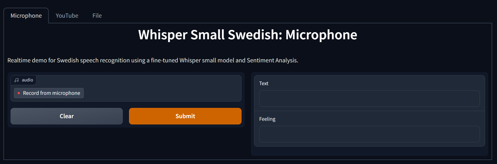
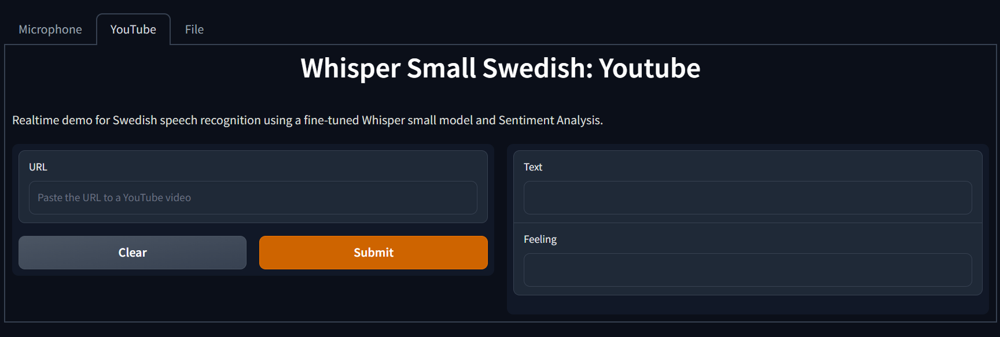
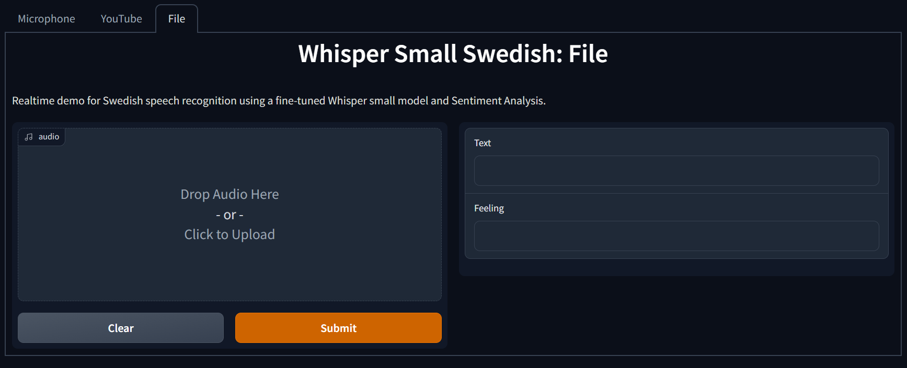
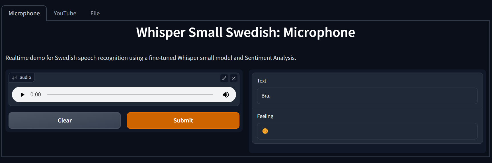
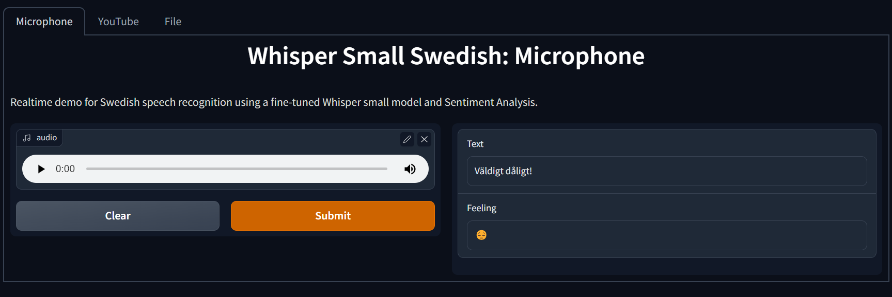

# Automatic Speech Recognition (ASR) - Fine-tune Whisper in Swedish
[Whisper](https://github.com/openai/whisper) is a speech recognition model for multilingual speech recognition as well as other tasks.
For this assignment, we will fine-tune Whisper in Swedish for ASR. Fine-tuning means that the weights of Whisper are used as the initial point of training. It is used to speed up the training and overcome small dataset size since we are using the information that the model has already learned and we are not starting from scratch with random weights.

## Steps
The first part of the assignment was to develop a feature pipeline (FeaturePipepile.ipynb) that loads the dataset, transform, split and save it in Hopsworks.
Then, we developed a training pipeline (Training.ipynb) that loads the transformed dataset from the previous step, loads Whisper from HuggingFace and train/fine-tune it on the dataset. 
The next step was to perform hyperparameter tuning to improve our model. 
Lastly, a UI was made in Hugging face with gradio to use the best model in real-time.

## Model Performance
There are 2 ways to improve the performance of our model. The data-centric approach and the model-centric approach. 
Data-centric approach means to train our model on more datasets. Model-centric approach means hyperparameter tuning, change the model architecture etc.

We chose to improve our model wih the model-centric approach with **Hyperparameter Tuning**. 
Due to the lack of resources and time, we did not perform an extensive search and we focused on one hyperparameter: **learning rate**.
The results after training for 1500 steps are shown below: 

| Learning Rate      | WER |
| ----------- | ----------- |
| 1e-3      | 109.48      |
| 1e-5   | 23.97        |
| 1e-6   | 24.12       |

So the best model is the model with learning rate = 1e-5 and can be found here: https://huggingface.co/Hoft/whisper-small-swedish-asr

## The App
The app is deployed on Huggingface: https://huggingface.co/spaces/Chrysoula/voice_to_text_swedish.
The user can either record theirselves or upload a youtube video or a local file. 
### Extra feature: Sentiment Analysis 
Sentiment Analysis has been added as an extra feature using a pretrained BERT in Swedish: https://huggingface.co/marma/bert-base-swedish-cased-sentiment. The produced sentence of our model is used as an input to the BERT model and an emoji is returned based on the feeling of the input (😊 for positive and 😔 for negative).

## Screenshots
### Microphone Tab

### Youtube Tab

### File Tab

### Sentiment Analysis: Positive

### Sentiment Analysis: Negative

